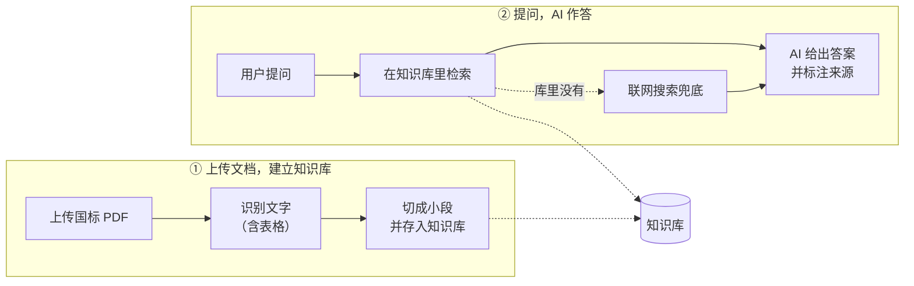

# FastRAG — 防水卷材国标问答知识库

导入防水卷材类国标/行标 PDF，OCR 切块入库，混合检索后由 Agent 标来源作答，库内查不到走联网兜底。
约束与术语见 [CLAUDE.md](CLAUDE.md) / [CONTEXT.md](CONTEXT.md)，决策见 [docs/adr/](docs/adr/)，高层结构见 [docs/架构文档.md](docs/架构文档.md)。

## 架构



- **建库**：上传国标 PDF → 自动识别文字和表格 → 切成带标号、页码的小段，存进知识库。
- **作答**：用户提问 → 先在知识库里检索 → AI 用库里原文作答并标来源；库里查不到时联网搜索兜底，结果标注「来源：联网」。

## 示例问法

不知道问什么，直接抄下面这些试。可以带标准号问得更准，也可以**用产品名或大白话问**（无需记标准号）。

| 想做什么 | 示例问题 |
| --- | --- |
| 查某标准某指标 | GB/T 18242-2025 弹性体塑性体改性沥青防水卷材，I 型卷材的可溶物含量要求是多少？ |
| 查某标准某指标 | GB/T 23457-2017 预铺防水卷材的拉力和钉杆撕裂强度要求是多少？ |
| 查某标准某指标 | JC/T 974-2005 道桥用改性沥青防水卷材，低温柔度要求是多少度？ |
| 查试验方法 | GB/T 328.18 钉杆法撕裂试验用多大直径的尖钉？拉伸速度多少？ |
| 试验方法 + 第几页 | 防水卷材吸水性怎么测？取样和判定规则在第几页？ |
| 不带标准号、大白话 | 湿铺防水卷材用在什么工程？靠什么和基层粘结？ |
| 不带标准号、用产品名 | 道桥用改性沥青防水卷材适用在什么地方？ |
| 行业专用（铁路/水运/公路） | 铁路桥梁混凝土桥面防水层有哪些性能要求？ |
| 查分类 / 术语 | GB/T 18242 的防水卷材按胎基分为哪两类？ |
| 库内没有 → 自动联网兜底 | PVC 防水卷材的拉伸强度要求是多少？ |

更多示例见 [docs/示例查询.md](docs/示例查询.md)。

## 技术栈

| 层 | 选型 |
| --- | --- |
| Agent / 编排 | Mastra（`@mastra/core` Agent + Tool、`@mastra/memory`、`@mastra/rag`、`@mastra/libsql`） |
| LLM 网关 | OpenRouter：对话 `deepseek/deepseek-v4-flash` + embedding `openai/text-embedding-3-small`（[ADR-0001](docs/adr/0001-model-routing-split.md)） |
| 向量库 / 存储 | libSQL（`@libsql/client`，本地 `file:` 文件库，向量与会话历史同库） |
| OCR | PaddleOCR-VL-1.6 托管 API，直吃 PDF，不本地渲染、不引 Python（[ADR-0003](docs/adr/0003-ocr-paddleocr-vl.md)） |
| 联网兜底 | Tavily |
| 运行时 / 工具 | Node 22 + `tsx`、AI SDK（`ai` v6）、`unpdf`、`zod` |
| 前端 | Vite + React 19 + React Router + Tailwind v4 + [ai-elements](https://elements.ai-sdk.dev/)（[ADR-0006](docs/adr/0006-ai-sdk-stream-ai-elements-ui.md)） |
| 鉴权 | 单 admin、`.env` 凭据、httpOnly 签名 cookie（[ADR-0007](docs/adr/0007-single-admin-auth-cookie.md)） |

## RAG：切片 / 向量化 / 检索

**切片**（[ADR-0004](docs/adr/0004-indicator-chunking-hybrid-retrieval.md)）

- OCR 出的指标表是带合并单元格的表格，整块嵌入会冲淡向量。先解析网格、归一化单位、清洗换行，再**按指标行切块**。
- 每块前缀 = 标准号 + 产品名 + 表名 + 指标名 作语义锚点（产品名从文件名提取，用户用产品名问也召得回），裸数字带着列头进向量空间。
- 表外正文走定长字符切块。每块都挂元数据（标准号 / 表名 / 指标名 / 页码 / 状态 / 文件名），答案能标来源。

**向量化**

- 入库与检索锁同一个 embedding 模型（向量空间一致），经 OpenRouter 向量化后写入 libSQL 向量索引。

**检索**

- **向量 + BM25 混合**：向量召回与 BM25 关键词召回各出一路，用 RRF 融合后取前若干条。
- **BM25 分词**：英文按字母段 / 数字段成词、中文切相邻二元，故「jc684」「328.18」也能对上库里空格写法「JC 684-1997」。
- **元数据过滤**在内存里做，按 标准号 / 表名 / 指标名 / 页码 收窄；两道护栏：过滤命中为空时自动回退裸召回，标准号归一化匹配（jc684 ↔ JC 684-1997）。

## 本地部署

需要 Node 22 + pnpm。

```bash
cp .env.example .env   # 填下表的 key
pnpm install
pnpm dev               # API + vite 热更新 → http://localhost:5173
```

打开 `http://localhost:5173`，用 `ADMIN_USER` / `ADMIN_PASSWORD` 登录，入库 PDF、检索问答都在页面上操作。

`.env` 关键 key（全大写）：

| key | 用途 |
| --- | --- |
| `OPENROUTER_API_KEY` | LLM：对话 + embedding |
| `PADDLE_API_KEY` | OCR |
| `TAVILY_API_KEY` | 联网兜底 |
| `ADMIN_USER` / `ADMIN_PASSWORD` / `SESSION_SECRET` | 单管理员鉴权（`SESSION_SECRET` 用 `openssl rand -hex 32`） |

线上部署在 fly.io（常驻 Node + 本地卷 libSQL），见 [ADR-0010](docs/adr/0010-deploy-fly-local-volume.md) 与 [docs/部署-fly.md](docs/部署-fly.md)。

## 评测

检索召回 + 来源标注的离线评测（读真实库，不走 vitest）：`npx tsx test/eval.ts`。

- **P0 召回率 Recall@K**（纯检索、不经 LLM）：默认裸召回量底线；`--filtered` 用标准号过滤量产线上界。
- **P2 来源正确**：`--llm` 端到端跑 Agent，校验答案引用的标准号对不对。
- 数据集在 `test/datasets/`：指标集（`eval-dataset`）+ 正文集（`--prose`）；`--newdocs` 切到「新增文档」评测集，专门验证新入库标准的召回。

```bash
npx tsx test/eval.ts            # 裸召回 P0（快、便宜）
npx tsx test/eval.ts --filtered # 带标准号过滤的 P0（产线路径）
npx tsx test/eval.ts --llm      # 端到端 P2 来源标注（耗对话 token）
npx tsx test/eval.ts --newdocs  # 新增文档评测集（可叠加 --prose）
```

## GitHub Actions 自动化

代码推到 `main` 分支后，`.github/workflows/deploy.yml` 会自动跑测试并部署到 fly.io，无需手动操作。
